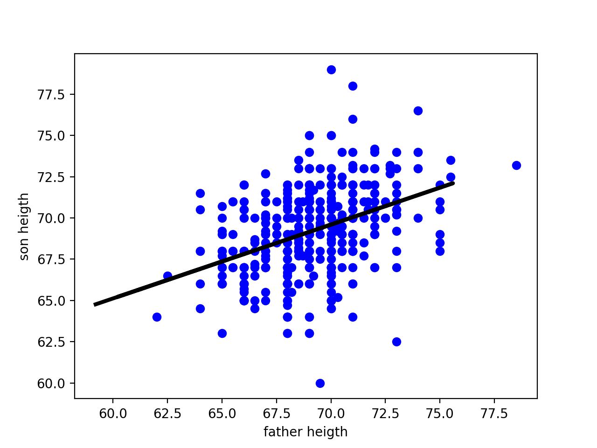
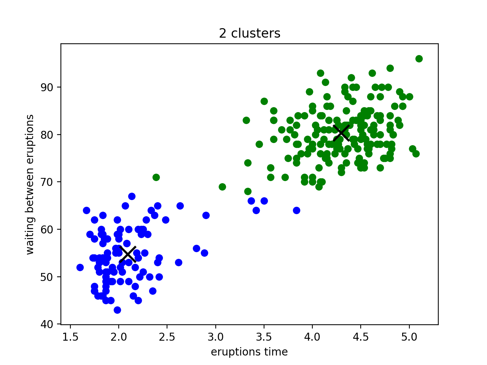

# Python Exercises

## Description

This examples intention is to use python 2.7 as a Stochastic (Commerically known as Machine Learning) programming tool.

## Installation

To install **Python** go to https://www.python.org/downloads/

In order to run this example you need to install the following dependencies

### Dependencies
numpy
sklearn
matplotlib
pandas

To install them use pip. First run the following command to know if pip is already installed:

`pip --version`

You must see the pip's version installed

If you don't have pip installed use this command:

`curl -L https://bootstrap.pypa.io/get-pip.py | python`

Once you have pip already installed run:

`pip install numpy sklearn matplotlib pandas`

## The examples

### Father and son heights
This example is based on the famous Pearson's Father and Son Data analysis for statitsticall analysis. https://en.wikipedia.org/wiki/Karl_Pearson. It intent to predict the heights of a a father's son given a bunch of previous data about that relationship

#### Execution

To execute the example run

`python LinearRegression.py`

The result must be something like:

```
   fatherheight  sonheight
0          78.5       73.2
1          75.5       73.5
2          75.5       72.5
3          75.0       71.0
4          75.0       70.5

Training
Giving the data set
[[72.8], [61.1], [67.4], [70.2], [75.6], [60.2], [65.3], [59.2]]
The predictions are
[ 70.85496061  65.61630997  68.43712185  69.69081602  72.10865478
  65.21333685  67.49685123  64.76558893]

```



### Volcanic eruptions
This example is a K-means analysis of the volcanic eruptions duration and waiting time until the next eruption. The objective is to cluster a particular eruption

#### Execution

To execute this example you need to run

`python K-meansClustering.py`

And you'll see an output like:

`[0 0 1 0 1 0]`


